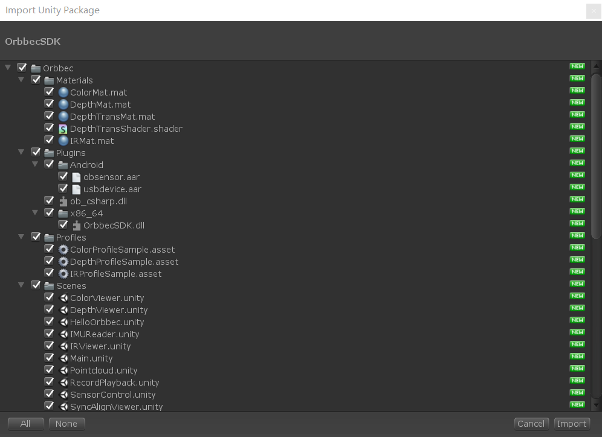
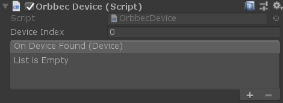
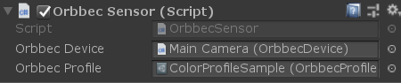
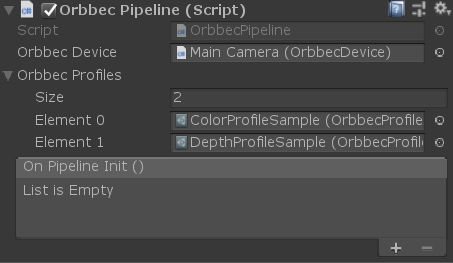
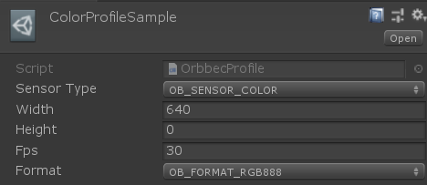
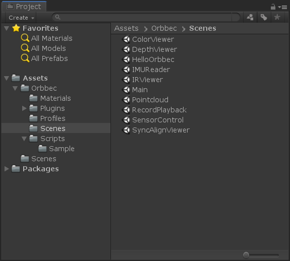

# 1. Overview

This document provides an introduction to the Orbbec SDK Unity Wrapper. The Orbbec SDK Unity Wrapper is designed and encapsulated based on the Orbbec SDK. It mainly implements data stream reception, device command control, and D2C functionality.  To ensure that users can correctly and efficiently integrate the Orbbec SDK Unity Wrapper SDK into their projects and prevent other issues caused by improper API calls, this document is drafted to standardize API usage.

# 2. Instructions for Using the Unity Wrapper SDK

## 2.1 SDK Import

Import the OrbbecSDK.unitypackage into Unity. The SDK has been verified to support Unity 2018.4 and above versions.  

## 2.2 Basic Usage of the SDK

The Unity SDK mainly includes components such as OrbbecDevice, OrbbecSensor, and OrbbecPipeline.

- OrbbecDevice is used to open the device, obtain the sensor, send control commands to the device, and perform other operations.  
 
- OrbbecSensor is used to open the sensor and obtain data streams.  
 
- OrbbecPipeline can simultaneously open multiple streams, set stream synchronization and alignment, and implement stream recording and playback.  
 
- OrbbecProfile is used to generate configuration files for video streams. It can set the width, height, frame rate, and format of the image, where 0 indicates unspecified.  
 

# 3. Example Descriptions

After importing the unitypackage, you can see several sample scenes in the Orbbec/Scenes directory, including HelloOrbbec, ColorViewer, DepthViewer, IRViewer, SyncAlignViewer, SensorControl, RecordPlayback, IMUReader, and Pointcloud.  

- HelloOrbbec demonstrates how to obtain information about the SDK and the device.
- ColorViewer demonstrates how to output and render color streams.
- DepthViewer demonstrates how to output and render depth streams.
- IRViewer demonstrates how to output and render infrared streams.
- SyncAlignViewer demonstrates how to simultaneously output color and depth streams and control the synchronization and alignment of the images.
- SensorControl demonstrates how to obtain and modify device properties.
- RecordPlayback demonstrates how to record and playback depth and color streams.
- IMUReader demonstrates how to obtain gyroscope and accelerometer data.
- Pointcloud demonstrates how to save depth point clouds and colored point clouds.

# 4. API Interface Introduction

If you want to implement more complex or flexible functionalities, you can directly call the C# interface. For specific details, please refer to the C# API manual. Most types in the C# API inherit the IDisposable interface, which means that they need to be disposed of by calling the Dispose method after use. Although these types are automatically released during garbage collection, it is still recommended to call this interface to release resources in a timely manner after use.

# Supported hardware products

| **products list** | **firmware version** |
| --- | --- |
| Femto Bolt       | 1.0.6  (windows 10 unsupported android) |
| Femto Mega       | 1.1.7  (windows 10,unsupported android)  |
| Gemini 2 XL      | Obox: V1.2.5  VL:1.4.54    |
| Astra 2          | 2.8.20                     |
| Gemini 2 L       | 1.4.32                     |
| Gemini 2         | 1.4.60 /1.4.76             |
| Astra+           | 1.0.22/1.0.21/1.0.20/1.0.19 |
| Femto            | 1.6.7                       |
| Femto W          | 1.1.8                       |
| DaBai            | 2436                        |
| DaBai DCW        | 2460                        |
| DaBai DW         | 2606                        |
| Astra Mini Pro   | 1007                        |
| Gemini E         | 3460                        |
| Gemini E Lite    | 3606                        |
| Gemini           | 3.0.18                      |
| Astra Mini S Pro | 1.0.05                      |
